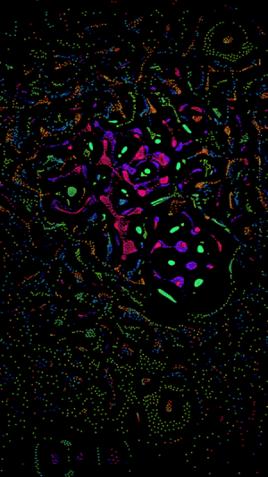
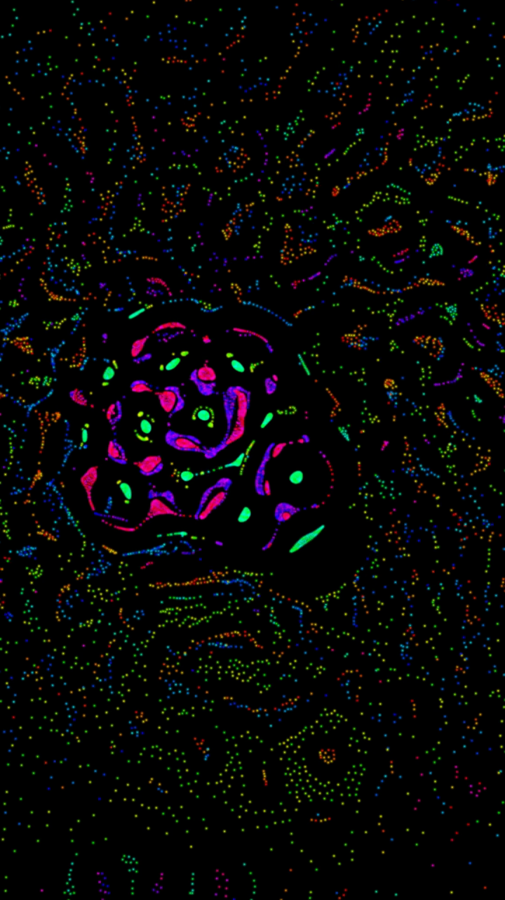
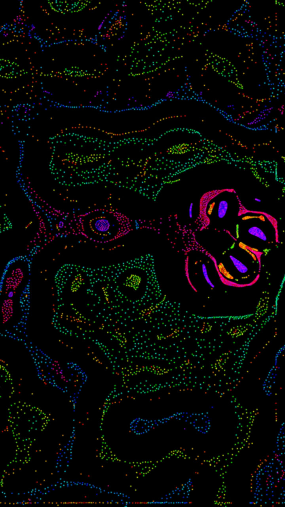
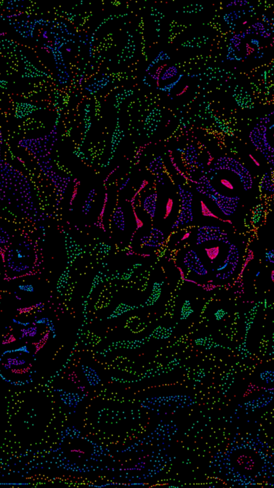
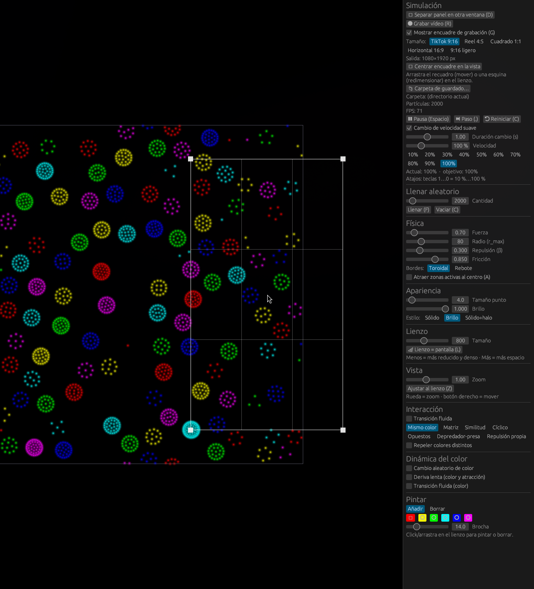

<h1 align="center">🐝 Enjambre — Puntos de Atracción</h1>

<p align="center">
  <em>Simulador interactivo de <strong>vida de partículas</strong> en Rust: miles de puntos de colores que se organizan solos en enjambres, células, anillos y estructuras vivas.</em>
</p>

<p align="center">
  
  
  
  
  
  
  
</p>

A partir de reglas simples de atracción y repulsión emergen patrones complejos —sin
que nadie los programe explícitamente—: enjambres, células, cadenas y ondas viajeras.

## 🎬 Demo

Vídeo vertical **9:16** grabado desde la propia app (tecla `R`), como los que se suben a TikTok:

<p align="center">
  
</p>

<p align="center">
  
  
  
</p>

> ▶️ **Vídeo en alta calidad** (1080×1920, 120 fps): [`docs/img/demo.mp4`](docs/img/demo.mp4).
> GitHub muestra un reproductor con la etiqueta de abajo; en otros visores, usa el enlace o el GIF.

<video src="docs/img/demo.mp4" controls loop muted width="300"></video>


## 🌌 ¿Qué es esto?

Cada partícula tiene un **color** (un matiz en la rueda de color) y siente una fuerza
hacia las demás que depende de:

- **La distancia** entre ellas (con un radio máximo de influencia `r_max`).
- **El color** del par, según el modo de interacción elegido.

Muy de cerca todas se **repelen** (no se apilan); a media distancia se **atraen o se
repelen** según las reglas de color. Con esas dos reglas básicas, más una pizca de
fricción, aparecen comportamientos colectivos sorprendentes — sin que nadie los
programe explícitamente.

## ✨ Características

- 🐝 **Hasta decenas de miles de partículas** en tiempo real. El cálculo de fuerzas usa
  un *hash* espacial (rejilla CSR) y se reparte entre todos los núcleos con
  [`rayon`](https://crates.io/crates/rayon).
- 🎨 **Ocho modos de interacción:**
  - **Mismo color** — solo los iguales se atraen (opcionalmente, los distintos se repelen).
  - **Matriz** — una tabla 6×6 editable define cuánto atrae/repele cada color a cada otro,
    al estilo *particle life* clásico. Botón para aleatorizar las reglas.
  - **Similitud** — la atracción depende de lo parecidos que sean los matices en la rueda
    de color (los tonos vecinos se atraen, los opuestos se repelen).
  - **Cíclico** (piedra-papel-tijera) — cada color persigue al siguiente de la rueda y huye
    del anterior: persecuciones, espirales y ondas viajeras.
  - **Opuestos** — los colores complementarios se atraen y los parecidos se repelen.
  - **Depredador–presa** — un bando caza y el otro huye en manada (interacción asimétrica).
  - **Repulsión propia** — el mismo color se repele y los distintos se atraen (mezclas
    homogéneas, espumas y mosaicos).
  - 🐦 **Bandada (Boids)** — murmuraciones de estorninos al estilo Craig Reynolds (1986):
    cada partícula sigue solo tres reglas locales —**separación** (no chocar),
    **alineación** (ir hacia donde van los vecinos) y **cohesión** (acercarse al grupo)— y
    emerge una nube coordinada de fibras cambiantes, sin líder. Ámbito ajustable (todas
    juntas, una bandada por color o híbrido) y velocidad de crucero para que no se detengan.
- ⚙️ **Física ajustable en vivo:** fuerza, radio, repulsión (β), fricción, velocidad (en %,
  con cambio suave y atajos 1…0) y bordes **toroidales** (la pantalla se enrolla) o de **rebote**.
- 🌈 **Dinámica del color:** cambios aleatorios de color, deriva lenta y gradual de
  colores y reglas, con transiciones suaves opcionales. La matriz puede **auto-aleatorizarse
  cada X segundos** para animaciones que evolucionan solas.
- 🎥 **Grabación de vídeo:** define con un **recuadro ajustable** sobre el lienzo (mover/redimensionar,
  con rejilla de tercios; tecla **`G`** para mostrar/ocultar) la zona a grabar, elige un **tamaño
  sugerido** (TikTok 9:16, 4:5, 1:1, 16:9…) y graba a 120 fps con la tecla **`R`** o el botón. El
  vídeo se codifica con `ffmpeg` a H.264; puedes **elegir la carpeta de guardado** desde la app.
- 🎞️ **Escenas:** guarda la configuración actual como una **instantánea con nombre** para reproducir un
  escenario cuando quieras, marca una como **predeterminada** (se carga al arrancar) y **cambia entre
  escenas** de forma instantánea o con una **transición suave** (interpola los parámetros y cruza el
  modo de interacción). Se guardan en `~/.config/enjambre/scenes.json`.
- 🖼️ **Lienzo + cámara:** lienzo de tamaño variable con zoom y desplazamiento (rueda para
  zoom hacia el cursor, botón derecho para mover). Botón **«Lienzo = pantalla»** que iguala
  el mundo a los píxeles de la ventana (1:1), para que llene el lienzo sea cual sea el
  tamaño que le dé el gestor de ventanas (ideal para tiling como Hyprland).
- 🪟 **Panel separable:** el panel de control puede vivir embebido a la derecha del lienzo
  o, con un clic, abrirse como **ventana del SO aparte** (proceso `panel`) que se puede
  tilear/redimensionar por separado. Ambos hablan por un socket Unix.
- 🖌️ **Pincel:** pinta o borra partículas del color que quieras directamente sobre el lienzo.
- 💡 **Tres estilos de dibujo:** sólido, brillo (*glow*) y sólido con halo.


## 🧰 Tecnologías

| Componente | Biblioteca |
|------------|------------|
| Render / ventana (lienzo) | [`macroquad`](https://crates.io/crates/macroquad) |
| Panel embebido | [`egui-macroquad`](https://crates.io/crates/egui-macroquad) |
| Panel en ventana aparte | [`eframe`](https://crates.io/crates/eframe) / [`egui`](https://crates.io/crates/egui) |
| IPC panel ↔ simulación | socket Unix + [`serde`](https://crates.io/crates/serde) (JSON) |
| Paralelismo | [`rayon`](https://crates.io/crates/rayon) |
| Aleatoriedad | [`rand`](https://crates.io/crates/rand) |
| Diálogo de carpeta | [`rfd`](https://crates.io/crates/rfd) (portal XDG) |
| Codificación de vídeo | [`ffmpeg`](https://ffmpeg.org/) (externo) |

## 🚀 Compilar y ejecutar

Necesitas [Rust](https://rustup.rs/) instalado.

El proyecto es un *workspace* de Cargo con tres crates: `sim` (la simulación y el
lienzo), `panel` (el panel en ventana aparte) y `shared` (parámetros, UI y el canal IPC
comunes).

```bash
# 1) Compilar TODO el workspace (sim + panel) en modo optimizado
cargo build --release

# 2) Ejecutar la simulación (va mucho más fluido en release)
cargo run -p sim --release
```

> **Importante:** compila el *workspace* entero (`cargo build`), no solo `-p sim`.
> El botón «Separar panel» lanza el binario `panel`, así que tiene que existir en
> `target/debug/` o `target/release/`. Si falta, el `sim` lo avisa por la terminal y
> sigue con el panel embebido.

El panel arranca embebido. Para separarlo, pulsa **«🗗 Separar panel en otra ventana»**:
el `sim` lanza automáticamente el binario `panel`. (También puedes ejecutarlo a mano con
`cargo run -p panel --release` mientras el `sim` está abierto.)

### 📊 Benchmark

Hay una prueba de rendimiento que mide los pasos de simulación por segundo para
5 000, 20 000 y 50 000 partículas:

```bash
cargo test -p sim --release throughput -- --nocapture
```

## 🎮 Controles rápidos

- **Rueda del ratón** — zoom hacia el cursor.
- **Botón derecho / central** — mover la vista (*pan*).
- **Botón izquierdo sobre el lienzo** — pintar o borrar (o mover/redimensionar el recuadro
  de grabación si está visible).
- Todo lo demás se ajusta desde el **panel de control** (embebido a la derecha o en
  su ventana aparte).

### ⌨️ Atajos de teclado (sobre la ventana del lienzo)

| Tecla | Acción | | Tecla | Acción |
|-------|--------|-|-------|--------|
| **Espacio** | Pausa / Reanudar | | **L** | Lienzo = pantalla |
| **.** | Paso a paso | | **Z** | Ajustar zoom al lienzo |
| **C** | Vaciar / Reiniciar | | **D** | Separar / reacoplar panel |
| **F** | Llenar aleatorio | | **R** | Grabar / detener vídeo |
| **M** | Aleatorizar matriz | | **G** | Mostrar / ocultar encuadre |
| **1…9 / 0** | Velocidad 10 %…100 % | | **A** | Atraer zonas activas al centro |
| **N / P** | Escena siguiente / anterior | | | |

## 🎥 Grabación de vídeo

1. Pulsa **`G`** (o el checkbox del panel) para mostrar el **recuadro de encuadre**; arrástralo
   para moverlo o coge una esquina para redimensionarlo. Elige un **Tamaño** sugerido en el panel.
2. Opcional: **📁 Carpeta de guardado…** abre un diálogo nativo para elegir dónde guardar.
3. Pulsa **`R`** (o el botón) para grabar y de nuevo para parar. Sale un `enjambre_<timestamp>.mp4`
   a 120 fps con exactamente la zona del recuadro, a la resolución del preset.

> Requiere **`ffmpeg`** instalado (`sudo pacman -S ffmpeg`). El diálogo de carpeta usa el **portal
> XDG**; en Hyprland instala `xdg-desktop-portal` + un backend (p. ej. `xdg-desktop-portal-gtk`
> o `-hyprland`). Sin portal, se guarda en el directorio actual.



## 🎞️ Escenas (instantáneas de configuración)

En la sección **Escenas** del panel:

1. Escribe un nombre y pulsa **📸 Guardar** para guardar la configuración actual como escena.
2. En la lista, **▶** carga una escena, **⟳** la **actualiza** con la configuración actual,
   **★** la marca como predeterminada (se carga al arrancar) y **🗑** la borra.
3. Marca **«Transición suave entre escenas»** (con su duración) para que al cargar una escena los
   parámetros se **interpolen** y el modo de interacción se **cruce** gradualmente; si lo desmarcas,
   el cambio es instantáneo.
4. **Ciclar:** botones **⏮/⏭** o teclas **`P`/`N`** para ir a la escena anterior/siguiente. Con
   **«Auto-avance (slideshow)»** cambia sola cada X segundos.
5. **Compartir/respaldar:** **⬆ Exportar todas** vuelca la colección a un `.json` (diálogo nativo) y
   **⬇ Importar…** la fusiona con la tuya.

Las escenas se guardan en `~/.config/enjambre/scenes.json` (solo los ajustes; las partículas se
rehacen con las nuevas reglas). **En el primer arranque** se siembran unas escenas de ejemplo
(Enjambres, Células, Cazadores, Cíclico, Espuma, Opuestos).

## 🗂️ Estructura del código

| Archivo | Responsabilidad |
|---------|-----------------|
| `sim/src/main.rs` | Bucle principal, cámara, modo embebido/separado y servidor IPC. |
| `sim/src/simulation.rs` | Partículas, integración de la física y perfil de fuerza. |
| `sim/src/grid.rs` | Hash espacial uniforme (CSR) para buscar vecinos rápido. |
| `sim/src/render.rs` | Dibujo por lotes de las partículas con texturas (sólido/glow/halo). |
| `shared/src/config.rs` | Parámetros, modos de interacción y utilidades de color. |
| `shared/src/panel_ui.rs` | UI egui del panel, compartida por ambos procesos. |
| `shared/src/ipc.rs` | Tipos de mensaje y encuadre del socket Unix. |
| `panel/src/main.rs` | Panel en ventana del SO aparte (cliente IPC, `eframe`). |

---

> Las capturas muestran 2 000 partículas; el simulador admite muchas más.
> Prueba a subir la cantidad, cambiar de modo y pulsar **🎲 Aleatorizar reglas**.
