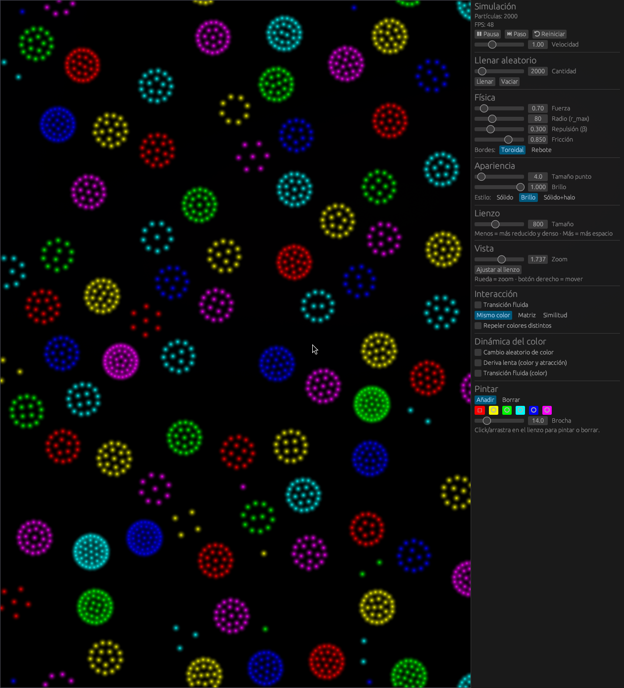
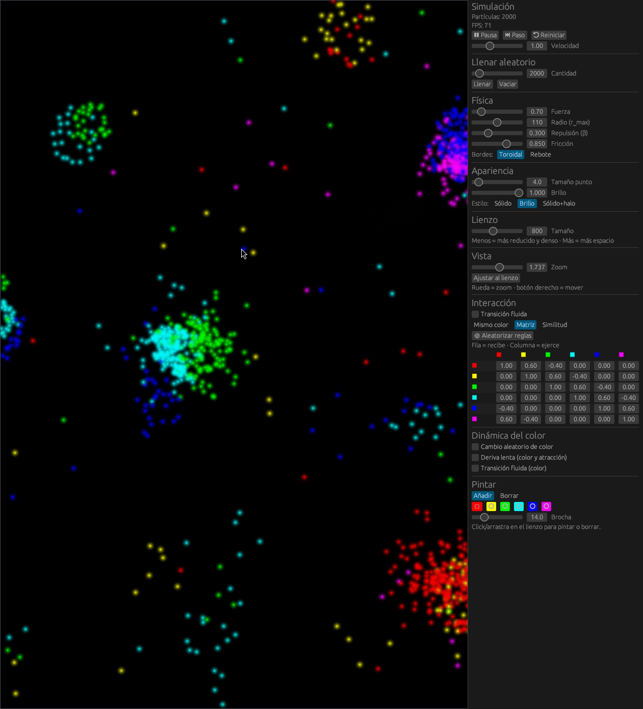

# Enjambre — Puntos de Atracción

Un simulador interactivo de **vida de partículas** (*particle life*) escrito en Rust.
Miles de puntos de colores se mueven según reglas simples de atracción y repulsión
y, a partir de ellas, emergen patrones complejos: enjambres, células, anillos,
cadenas y estructuras que parecen vivas.



## ¿Qué es esto?

Cada partícula tiene un **color** (un matiz en la rueda de color) y siente una fuerza
hacia las demás que depende de:

- **La distancia** entre ellas (con un radio máximo de influencia `r_max`).
- **El color** del par, según el modo de interacción elegido.

Muy de cerca todas se **repelen** (no se apilan); a media distancia se **atraen o se
repelen** según las reglas de color. Con esas dos reglas básicas, más una pizca de
fricción, aparecen comportamientos colectivos sorprendentes — sin que nadie los
programe explícitamente.

## Características

- **Hasta decenas de miles de partículas** en tiempo real. El cálculo de fuerzas usa
  un *hash* espacial (rejilla CSR) y se reparte entre todos los núcleos con
  [`rayon`](https://crates.io/crates/rayon).
- **Siete modos de interacción:**
  - **Mismo color** — solo los iguales se atraen (opcionalmente, los distintos se repelen).
  - **Matriz** — una tabla 6×6 editable define cuánto atrae/repele cada color a cada otro,
    al estilo *particle life* clásico. Botón para aleatorizar las reglas.
  - **Similitud** — la atracción depende de lo parecidos que sean los matices en la rueda
    de color (los tonos vecinos se atraen, los opuestos se repelen).
  - **Cíclico** (piedra-papel-tijera) — cada color persigue al siguiente de la rueda y huye
    del anterior: persecuciones, espirales y ondas viajeras.
  - **Opuestos** — los colores complementarios se atraen y los parecidos se repelen.
  - **Depredador–presa** — un bando caza y el otro huye en manada (interacción asimétrica).
  - **Repulsión propia** — el mismo color se repele y los distintos se atraen (mezclas
    homogéneas, espumas y mosaicos).
- **Física ajustable en vivo:** fuerza, radio, repulsión (β), fricción, velocidad y
  bordes **toroidales** (la pantalla se enrolla) o de **rebote**.
- **Dinámica del color:** cambios aleatorios de color, deriva lenta y gradual de
  colores y reglas, con transiciones suaves opcionales.
- **Lienzo + cámara:** lienzo de tamaño variable con zoom y desplazamiento (rueda para
  zoom hacia el cursor, botón derecho para mover). Botón **«Lienzo = pantalla»** que iguala
  el mundo a los píxeles de la ventana (1:1), para que llene el lienzo sea cual sea el
  tamaño que le dé el gestor de ventanas (ideal para tiling como Hyprland).
- **Panel separable:** el panel de control puede vivir embebido a la derecha del lienzo
  o, con un clic, abrirse como **ventana del SO aparte** (proceso `panel`) que se puede
  tilear/redimensionar por separado. Ambos hablan por un socket Unix.
- **Pincel:** pinta o borra partículas del color que quieras directamente sobre el lienzo.
- **Tres estilos de dibujo:** sólido, brillo (*glow*) y sólido con halo.



## Tecnologías

| Componente | Biblioteca |
|------------|------------|
| Render / ventana (lienzo) | [`macroquad`](https://crates.io/crates/macroquad) |
| Panel embebido | [`egui-macroquad`](https://crates.io/crates/egui-macroquad) |
| Panel en ventana aparte | [`eframe`](https://crates.io/crates/eframe) / [`egui`](https://crates.io/crates/egui) |
| IPC panel ↔ simulación | socket Unix + [`serde`](https://crates.io/crates/serde) (JSON) |
| Paralelismo | [`rayon`](https://crates.io/crates/rayon) |
| Aleatoriedad | [`rand`](https://crates.io/crates/rand) |

## Compilar y ejecutar

Necesitas [Rust](https://rustup.rs/) instalado.

El proyecto es un *workspace* de Cargo con tres crates: `sim` (la simulación y el
lienzo), `panel` (el panel en ventana aparte) y `shared` (parámetros, UI y el canal IPC
comunes).

```bash
# 1) Compilar TODO el workspace (sim + panel) en modo optimizado
cargo build --release

# 2) Ejecutar la simulación (va mucho más fluido en release)
cargo run -p sim --release
```

> **Importante:** compila el *workspace* entero (`cargo build`), no solo `-p sim`.
> El botón «Separar panel» lanza el binario `panel`, así que tiene que existir en
> `target/debug/` o `target/release/`. Si falta, el `sim` lo avisa por la terminal y
> sigue con el panel embebido.

El panel arranca embebido. Para separarlo, pulsa **«🗗 Separar panel en otra ventana»**:
el `sim` lanza automáticamente el binario `panel`. (También puedes ejecutarlo a mano con
`cargo run -p panel --release` mientras el `sim` está abierto.)

### Benchmark

Hay una prueba de rendimiento que mide los pasos de simulación por segundo para
5 000, 20 000 y 50 000 partículas:

```bash
cargo test -p sim --release throughput -- --nocapture
```

## Controles rápidos

- **Rueda del ratón** — zoom hacia el cursor.
- **Botón derecho / central** — mover la vista (*pan*).
- **Botón izquierdo sobre el lienzo** — pintar o borrar (según la brocha activa).
- Todo lo demás se ajusta desde el **panel de control** (embebido a la derecha o en
  su ventana aparte).

## Estructura del código

| Archivo | Responsabilidad |
|---------|-----------------|
| `sim/src/main.rs` | Bucle principal, cámara, modo embebido/separado y servidor IPC. |
| `sim/src/simulation.rs` | Partículas, integración de la física y perfil de fuerza. |
| `sim/src/grid.rs` | Hash espacial uniforme (CSR) para buscar vecinos rápido. |
| `sim/src/render.rs` | Dibujo por lotes de las partículas con texturas (sólido/glow/halo). |
| `shared/src/config.rs` | Parámetros, modos de interacción y utilidades de color. |
| `shared/src/panel_ui.rs` | UI egui del panel, compartida por ambos procesos. |
| `shared/src/ipc.rs` | Tipos de mensaje y encuadre del socket Unix. |
| `panel/src/main.rs` | Panel en ventana del SO aparte (cliente IPC, `eframe`). |

---

> Las capturas muestran 2 000 partículas; el simulador admite muchas más.
> Prueba a subir la cantidad, cambiar de modo y pulsar **🎲 Aleatorizar reglas**.
